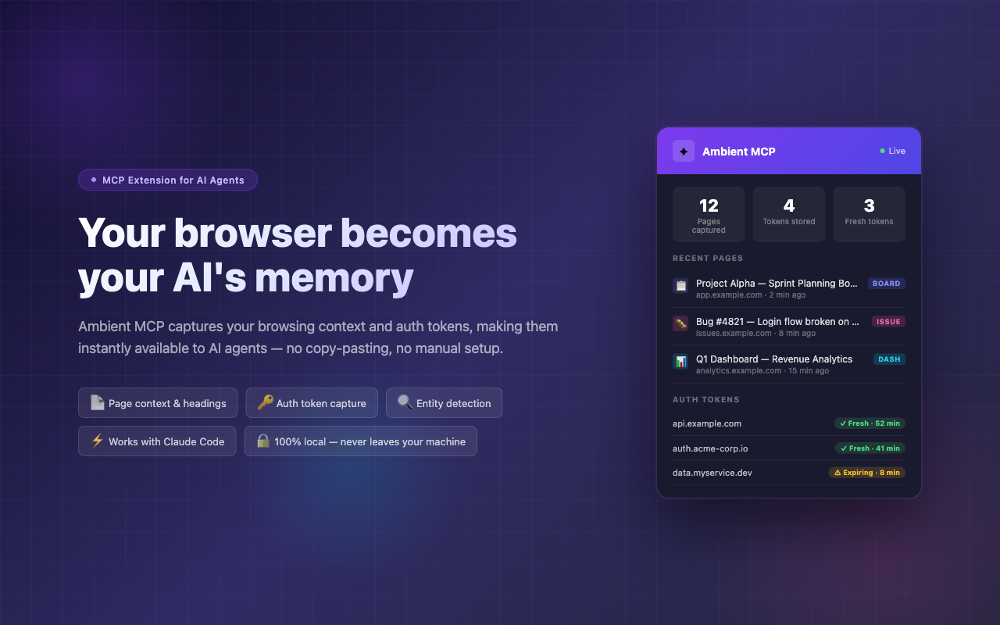
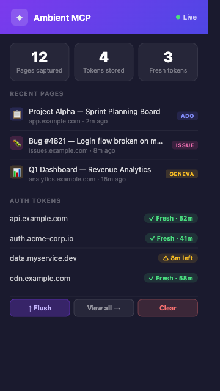
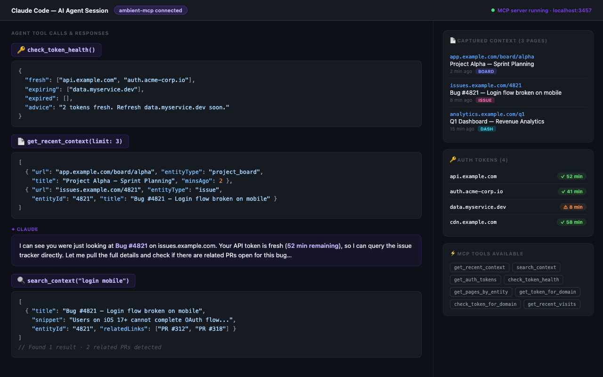

# 🧠 Ambient MCP — Browser Context for AI Agents

> **Your browser becomes your AI's memory.**
> Every page you visit, every auth token you hold, every minute you spend — all of it becomes searchable, queryable context for your AI agents.

[](https://www.npmjs.com/package/ambient-mcp)
[](https://modelcontextprotocol.io)
[](https://developer.chrome.com/docs/extensions/mv3/)
[](https://nodejs.org)
[](LICENSE)
[](PRIVACY.md)

---



---

## The Problem

AI agents are powerful — but blind. They don't know:
- **What you were just looking at** when you ask for help
- **Which ICM incident, ADO work item, or GitHub PR** triggered your question
- **Whether your auth token** to Azure / Microsoft Graph / Kusto is still valid
- **What you spent the last 2 hours investigating** before asking for a summary

You end up copy-pasting context, re-explaining your work, and re-authenticating constantly. Every new conversation starts cold.

---

## The Solution

**Ambient MCP** is a Chrome extension + local MCP server that silently captures your browsing activity and streams it to your AI agents as structured context.

```
┌─────────────────────────────────────────────────────────────────┐
│                     YOUR BROWSER                                │
│                                                                 │
│  chrome.webRequest ──► Auth tokens (JWT decoded, expiry)        │
│  chrome.webNavigation ► Page visits (URL, title, duration)      │
│  content.js ──────────► Page context (text, headings, entities) │
│                                    │                            │
└────────────────────────────────────┼────────────────────────────┘
                                     │ POST /ingest/  (localhost)
                          ┌──────────▼─────────────┐
                          │   MCP Server :3457      │
                          │   store.json persisted  │
                          │   ~/.claude/ambient-mcp │
                          └──────────┬──────────────┘
                                     │ JSON-RPC stdio
                    ┌────────────────▼────────────────────────┐
                    │         YOUR AI AGENT (Claude)           │
                    │                                          │
                    │  get_recent_context()  ─► "User was just│
                    │  search_context("ICM")  ─► viewing ICM  │
                    │  check_token_health()   ─► 759120401..." │
                    │  get_auth_tokens()      ─► Token: fresh, │
                    │                            47 min left   │
                    └──────────────────────────────────────────┘
```

---

## Extension Popup



The extension popup shows live stats — pages captured, tokens stored, fresh token count — with recent page activity and auth token status at a glance.

---

## What Gets Captured

| Data | What It Includes |
|------|-----------------|
| **Page Context** | Title, URL, main text snippet, headings, entity type (ICM/ADO/GitHub/Teams/etc.), extracted GUIDs/IDs, related links |
| **Auth Tokens** | Authorization headers, decoded JWT claims (user, audience, scopes, expiry), token status (fresh/expiring/expired) |
| **Navigation History** | Per-page visit duration, tab activity, timeline of what you worked on |

**Entity Types Detected Automatically:**
`icm_incident` · `ado_work_item` · `ado_pr` · `ado_build` · `github_pr` · `github_issue` · `teams_meeting` · `teams_channel` · `outlook_email` · `outlook_calendar` · `azure_portal` · `geneva_logs` · `sharepoint` · `onedrive` · `wiki_page`

---

## Real-World Impact: Before vs After

### Scenario 1: Investigating an Incident

**Without Ambient MCP:**
> You: "Help me investigate this Teams incident"
> Agent: "What's the incident ID? What service? What tenant? What logs have you checked?"
> *(You copy-paste 10 items of context manually)*

**With Ambient MCP:**
> You: "Help me investigate this Teams incident"
> Agent calls `get_recent_context()` → sees you've been on ICM #759120401, visited the Geneva log dashboard, browsed a related ADO work item, and have a fresh Kusto token for `icmcluster.kusto.windows.net`
> Agent: "I can see you've been investigating ICM #759120401. You have a valid Kusto token — let me query the incident timeline and check related telemetry..."

### Scenario 2: Writing a PR Description

**Without Ambient MCP:**
> You: "Write a PR description for my changes"
> Agent: "What repo? What was the issue? What does this fix?"

**With Ambient MCP:**
> Agent calls `get_pages_by_entity("ado_work_item")` and `get_pages_by_entity("ado_pr")` → finds the bug you were triaging, the PR you have open, and the related work items you visited
> Agent: "Based on the work item #12345 you were reviewing and the PR #678 you opened, here's a description..."

### Scenario 3: Making an API Call on Your Behalf

**Without Ambient MCP:**
> Agent tries to call Microsoft Graph → "I need an auth token — please provide it"

**With Ambient MCP:**
> Agent calls `check_token_for_domain("graph.microsoft.com")`
> Response: `{ valid: true, reason: "fresh", minsLeft: 47 }`
> Agent calls `get_token_for_domain("graph.microsoft.com")` → gets the Bearer token
> Agent: "Using your existing Graph token (47 minutes remaining)..."

### Scenario 4: Daily Standup / Work Summary

**Without Ambient MCP:**
> You: "What did I work on today?"
> Agent: "I don't have visibility into what you worked on."

**With Ambient MCP:**
> Agent calls `get_recent_visits(limit=200)` → sees you spent 45 min on ICM #750444345, 20 min on ADO PR #98765, 30 min in Teams channel "SMBA Oncall"
> Agent: "Today you focused on: (1) Investigating ICM #750444345 — Teams message delivery failure. (2) Reviewing PR #98765. (3) Monitoring your oncall channel. You spent the most time on the incident investigation."

---

## MCP Tools Reference

Your AI agent gets 8 tools that give it full awareness of your work:

### `get_recent_context(limit?)`
Returns the N most recently visited pages with full context.
```json
{
  "url": "https://portal.microsofticm.com/imp/v3/incidents/details/759120401",
  "title": "Teams message delivery failure in APAC",
  "entityType": "icm_incident",
  "entityId": "759120401",
  "snippet": "Incident created 2026-03-09. Forest: APCPROD...",
  "headings": ["Incident Summary", "Impact", "Timeline"],
  "identifiers": { "guids": ["abc123..."], "icmIds": ["759120401"] },
  "capturedAt": "2026-03-09T20:15:30Z"
}
```

### `search_context(query)`
Full-text search across all visited pages.
```
search_context("759120401")    → finds the ICM page + any related pages
search_context("deploy hotfix") → finds ADO work items + wiki pages mentioning it
search_context("tenant ID")    → finds pages with that GUID
```

### `check_token_health()`
Check all auth tokens before making any API calls.
```json
{
  "summary": { "fresh": 5, "expiringSoon": 1, "expired": 2, "unknown": 3 },
  "warnings": ["2 expired token(s): outlook.cloud.microsoft, dev.azure.com"],
  "advice": "Some tokens are expired. Tell the user to open the affected site(s)."
}
```

### `check_token_for_domain(domain)`
Validate a specific token before use.
```json
{
  "domain": "graph.microsoft.com",
  "valid": true,
  "reason": "fresh",
  "minsLeft": 47,
  "advice": "Token for graph.microsoft.com is valid (47 minutes remaining). Safe to use."
}
```

### `get_auth_tokens(domain?)`
Get all captured tokens with decoded JWT claims.

### `get_token_for_domain(domain)`
Get full token details for a specific domain (use with API calls).

### `get_pages_by_entity(entity_type)`
Filter recent pages by type (e.g., all ICM incidents, all GitHub PRs).

### `get_recent_visits(limit?)`
Navigation history with time spent per page — understand the user's work timeline.

---

## Installation

### Step 1: Start the MCP Server (zero install)

```bash
npx ambient-mcp
```

That's it. No git clone, no `npm install`. The server starts on port 3457 and persists data to `~/.claude/browser-context-mcp/store.json`.

> **Requires Node.js 18+**

### Step 2: Register with Claude Code

Add to your `.mcp.json` (project root) or `~/.claude/mcp.json` (global):

```json
{
  "mcpServers": {
    "browser-context": {
      "command": "npx",
      "args": ["ambient-mcp"]
    }
  }
}
```

Restart Claude Code — the `browser-context` MCP server starts automatically.

### Step 3: Install the Chrome Extension

1. Clone this repo (for the extension files):
   ```bash
   git clone https://github.com/RajuRoopani/ambient-mcp.git
   ```
2. Open Chrome → `chrome://extensions`
3. Enable **Developer mode** (top-right toggle)
4. Click **Load unpacked**
5. Select the `extension/` folder

The extension icon appears in your toolbar. Click it to see the live status dashboard.

### Step 4: Browse Normally

Visit any page — Microsoft Teams, ICM, Azure DevOps, GitHub, Outlook, Azure Portal. The extension silently captures context in the background. The popup shows a live count of tokens, pages, and visits captured.

**First capture takes ~15 seconds** (the flush interval). After that, every new page is available to your AI agent instantly.

---

## Agent Context Example



---

## Verifying It Works

### Check Server Health
```bash
curl http://localhost:3457/health
```
```json
{
  "ok": true,
  "tokens": 12,
  "pages": 47,
  "visits": 203
}
```

### Search Your History
```bash
curl "http://localhost:3457/context/search?q=ICM"
```

### Check Token Status
```bash
curl http://localhost:3457/tokens/health
```

### Ask Claude
Once your extension has captured a few pages, ask Claude Code:
> "What have I been working on recently?"
> "Do I have a valid Azure DevOps token?"
> "Find any ICM incidents I've been looking at today"

---

## Architecture

```
browser-context-mcp/
├── extension/               # Chrome Extension (MV3)
│   ├── manifest.json        # Permissions: webRequest, alarms, notifications, scripting
│   ├── background.js        # Service worker: token capture, visit tracking, expiry alerts
│   ├── content.js           # Page context extraction, entity detection, SPA support
│   ├── popup.html           # Status dashboard UI (dark purple/indigo theme)
│   └── popup.js             # Real-time health display, manual flush/clear
│
└── server/                  # Node.js MCP Server (published to npm as `ambient-mcp`)
    ├── server.js            # Dual-protocol: HTTP :3457 (ingest) + MCP stdio (agent tools)
    ├── store.js             # In-memory store with JSON persistence + TTL pruning
    └── package.json         # Zero dependencies (pure Node.js)
```

### Data Flow

```
1. You visit a page
   └─► content.js extracts: title, text, entity type, GUIDs, headings, related links
       └─► background.js sends: POST /ingest/page

2. You make a request to an API (Azure, GitHub, Outlook, etc.)
   └─► background.js intercepts: Authorization header
       └─► Decodes JWT, extracts: user, expiry, audience, scopes
           └─► background.js sends: POST /ingest/tokens

3. Every 15 seconds: visit batch flushed → POST /ingest/visits

4. Every 30 seconds: token expiry check → browser notification if expiring in <5 min

5. AI agent receives a message
   └─► Calls MCP tools via stdio JSON-RPC
       └─► Server queries in-memory store
           └─► Returns structured context to agent
```

### Persistence

All data persists to `~/.claude/browser-context-mcp/store.json` — a **shared location** across all your Claude Code projects. One token store, one page history, available everywhere.

---

## HTTP API Reference

The server exposes a local REST API used by the extension and available for your own scripts:

| Method | Path | Description |
|--------|------|-------------|
| `GET` | `/health` | Server stats + token list + retention policy |
| `POST` | `/ingest/page` | Ingest a page context object |
| `POST` | `/ingest/visits` | Ingest an array of page visits |
| `POST` | `/ingest/tokens` | Ingest an array of auth tokens |
| `GET` | `/context/recent?limit=N` | Recent pages (default 20) |
| `GET` | `/context/search?q=QUERY` | Full-text search over pages |
| `GET` | `/tokens` | All captured tokens |
| `GET` | `/tokens/health` | Token health breakdown (fresh/expiring/expired) |
| `GET` | `/tokens/check/:domain` | Validate token for a specific domain |
| `POST` | `/context/prune` | Manually trigger data pruning |
| `POST` | `/context/clear` | Clear all stored data |

### Example: Using a Captured Token in Your Own Script

```python
import requests, json

# Get the token for a Microsoft service
resp = requests.get("http://localhost:3457/tokens")
tokens = {t["domain"]: t for t in resp.json()}

# Use the Graph token
graph = tokens.get("graph.microsoft.com")
if graph and graph["status"] == "fresh":
    headers = {"Authorization": f"Bearer {graph['headers']['Authorization'].split(' ')[1]}"}
    me = requests.get("https://graph.microsoft.com/v1.0/me", headers=headers).json()
    print(f"Logged in as: {me['displayName']}")
```

---

## Configuration

All settings are in `server/store.js` constants:

| Setting | Default | Description |
|---------|---------|-------------|
| `HISTORY_TTL_DAYS` | `5` | Pages and visits older than this are pruned |
| `EXPIRED_TOKEN_TTL_HOURS` | `24` | Expired tokens removed after this grace period |
| `MAX_PAGES` | `500` | Hard cap on stored pages |
| `MAX_VISITS` | `2000` | Hard cap on stored visits |
| `PRUNE_INTERVAL_MS` | `3600000` | How often auto-prune runs (1 hour) |

The extension flush interval (15s) and expiry check interval (30s) are in `extension/background.js`.

---

## Privacy & Security

### Data Stays Local
- The server binds to `localhost:3457` only — no external network access
- All data persists in `~/.claude/browser-context-mcp/store.json` on your machine
- Nothing is sent to any cloud service or third party

### What Gets Captured
- **Auth tokens**: Yes, including Bearer tokens and decoded JWT claims. This is intentional — it's what gives AI agents the ability to act on your behalf.
- **Page content**: Text snippets, headings, entity IDs — not full page HTML
- **Navigation history**: URLs visited and time spent — similar to browser history

### What To Know
- Store file contains **plaintext tokens** — protect it like you would `.env` files
- Add `~/.claude/browser-context-mcp/store.json` to your backup exclusions if desired
- Tokens auto-expire following their JWT `exp` claim and are pruned after 24h

Read the full [Privacy Policy](PRIVACY.md).

### gitignore
The store file is excluded by default — tokens are **never committed to git**.

---

## How AI Agents Should Use This

**Best practice prompt addition** for your Claude Code system prompt or `CLAUDE.md`:
```markdown
## Browser Context
You have access to a `browser-context` MCP server that tracks my recent browsing activity.
- ALWAYS call `check_token_health()` before making any API calls on my behalf
- Call `get_recent_context()` at the start of any investigation to understand what I was looking at
- Use `search_context(query)` to find pages related to a specific incident, ticket, or topic
- Use `get_token_for_domain(domain)` to get auth tokens for API calls — never ask me to paste tokens
```

---

## Contributing

Contributions welcome! Key areas for improvement:

- [ ] **Firefox support** — port to MV3 Firefox extension API
- [ ] **Safari support** — Safari Web Extensions
- [ ] **Encrypted store** — encrypt `store.json` at rest using system keychain
- [ ] **Selective capture** — per-domain opt-out rules
- [ ] **More entity types** — ServiceNow, Jira, Linear, Notion, Confluence
- [ ] **Semantic search** — embeddings-based search instead of substring match
- [ ] **Token refresh** — auto-refresh expired tokens via OAuth2 refresh flow
- [ ] **SSE streaming** — push updates to agents in real-time instead of polling

### Development Setup

```bash
# Server (watch mode)
cd server && npm install
node --watch server.js

# Extension
# Load from chrome://extensions → Load unpacked → select extension/ folder
# Chrome auto-reloads on file changes when in dev mode
```

---

## License

MIT — use it, fork it, build on it. If you make something cool, let us know.

---

<p align="center">
  <strong>Built for engineers who live in the browser and want their AI agents to keep up.</strong>
</p>
